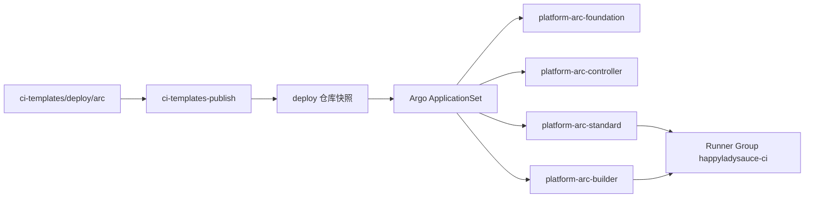

# ARC 实现

给要理解本组织 self-hosted runner、改 Scale Set 容量、或给新仓库接流水线的人。
集群 Secret、节点污点和 Chart 镜像步骤见 deploy 仓库的
[ARC CI Runner 池](https://github.com/HappyLadySauceM/deploy/blob/main/docs/ci-runners.md)。
非密钥 values 在 [deploy/arc](../deploy/arc/)。

## ARC 是什么

**Actions Runner Controller（ARC）** 是 GitHub 官方在 Kubernetes 上跑
self-hosted runner 的方案。本组织用的是 **gha-runner-scale-set**（CRD
`AutoscalingRunnerSet`），按 Scale Set 弹性创建 **ephemeral** runner：一个
GitHub Actions job 对应一个 Pod，job 结束 Pod 销毁。

不是旧版 `actions-runner-controller` 那种长期存活的单 runner Deployment，也
不是宿主机上的 `devops` runner。

和旧宿主机 runner 的差别：

- 按 job 起 Pod，互不复用 workspace。
- `hls-standard` 不挂宿主机 Docker socket。
- `hls-builder` 的 Docker-in-Docker 关在独立 namespace，视为特权执行环境。
- 语言/工具缓存在节点 hostPath，由 ARC 挂载；workflow 不要自己去挂宿主机目录，
  也不要启用 GitHub Actions cache。

组织级 Runner Group 名为 `happyladysauce-ci`，对组织全部仓库可见。Scale Set
的 `scaleSetLabels` 就是 workflow 里的 `runs-on`：

| `runs-on` | 干什么 |
| --- | --- |
| `hls-standard` | plan、质量门禁、release notes、GitOps、Argo、smoke、cleanup |
| `hls-builder` | BuildKit / Docker-in-Docker、base image prewarm、service matrix |

仓库管理员必须把 `hls-builder` 当成特权环境：它能构建并推送镜像。

## 本组织如何实现



### GitOps 真源

非密钥 values、namespace、ResourceQuota 和 ServiceAccount 的真源是本仓库
[`deploy/arc`](../deploy/arc/)。`ci-templates-publish` 用 `promote-snapshot`
按 CAS 把它同步到 [HappyLadySauceM/deploy](https://github.com/HappyLadySauceM/deploy)
的 `ci-templates/deploy/arc`。

**禁止手改 deploy 仓库里的 `ci-templates/` 快照。** 改容量或镜像 tag 只改本仓库
`deploy/arc`，推 `main`，等发布工作流写入 GitOps。

Argo ApplicationSet 配置在 deploy 的
[`k3s/appsets/platform/configs/platform-arc-*.yaml`](https://github.com/HappyLadySauceM/deploy/tree/main/k3s/appsets/platform/configs)：

| Application | 类型 | 内容 |
| --- | --- | --- |
| `platform-arc-foundation` | native kustomize | namespace、Quota、ServiceAccount |
| `platform-arc-controller` | Helm `gha-runner-scale-set-controller` 0.14.2 | controller，2 replica |
| `platform-arc-standard` | Helm `gha-runner-scale-set` 0.14.2 | `hls-standard` |
| `platform-arc-builder` | Helm `gha-runner-scale-set` 0.14.2 | `hls-builder` |

Chart 从 Harbor OCI `harbor.harbor.svc.cluster.local/helm` 读；values 文件是
deploy 快照里的路径，例如 `$values/ci-templates/deploy/arc/standard/values.yaml`。
同步顺序：foundation → controller → 两个 Scale Set。

Helm/YAML 里的 CPU 必须写成带引号的字符串（`"2"`、`"4"`），否则可能被解析成
数字，chart 会拒收。

### 当前容量

以 [`standard/values.yaml`](../deploy/arc/standard/values.yaml) 和
[`builder/values.yaml`](../deploy/arc/builder/values.yaml) 为准。

| 池 | Namespace | min / max | 每 Pod 资源 | namespace 配额 |
| --- | --- | --- | --- | --- |
| `hls-standard` | `arc-runners-standard` | 1 / 8 | request 2 CPU / 4Gi，limit 4 CPU / 8Gi | 32 CPU / 64Gi（pods 上限 12） |
| `hls-builder` | `arc-runners-builder` | 0 / 8 | DinD request `"2"` / 1Gi、limit `"4"` / 4Gi；runner 同样 CPU，内存 512Mi / 1Gi；init `500m` / `256Mi`。8 个 limit 合计 68 CPU / 42Gi | 68 CPU / 42Gi（pods 上限 10；request 仍 64/40Gi） |
| controller | `arc-system` | 2 replica | 见 controller values |  |

不要把 ResourceQuota 的 `pods` 当成 `maxRunners`。standard 配额允许 12 个 Pod、
builder 允许 10 个，是为了滚动重叠；Scale Set 实际最多 8 个 runner。

`request` 只给 kube-scheduler 和 ResourceQuota 做加法，不是 JVM `-Xms` 那种预留。
`limit` 是 cgroup 天花板（`cpu.max` / `memory.max`）。8 个 standard 加 8 个
builder 的 request 约 52 CPU / 46Gi，可以调度到约 80 CPU / 64Gi 的节点，但还要
扣除平台 Pod 已使用的资源；limit 合计约 100 CPU / 106Gi，真打满会 CPU 节流、
内存压力或 kubelet 驱逐（QoS Burstable）。standard 单节点同时承载 8 个 runner
时必须监控 `MemoryPressure`、`MemAvailable` 和 `OOMKilled`，必要时先降低
`maxRunners`。
builder 每 Pod 应用容器 limit 仍是 8 CPU / 5Gi；init 必须再带 `500m` /
`256Mi` limit（namespace 写了 `limits.*` 时 Kubernetes 要求每个容器都写
limit，否则 Pod 会被 ResourceQuota 拒绝）。因此 limit 配额是 68 CPU /
42Gi，request 配额仍是 64 CPU / 40Gi。

两个池都调度到 `workload.happyladysauce.local/ci=true`，并容忍对应污点。
`hls-standard` 容器非 root（uid 1001）、drop ALL、不是 privileged 容器。
`hls-builder` 的 DinD 容器才 `privileged: true`。

### Pod Security 与节点缓存

四个以上 standard runner 要共用同一份节点缓存。`hostPath` 在 Pod Security
`restricted` 和 `baseline:latest` 下都被禁止；local PV 又是 ReadWriteOnce，
没法给四个 Pod 同时挂。因此 `arc-runners-standard` 的 enforce 是
**privileged**，只为允许 hostPath。builder namespace 同样 privileged，因为
DinD。

节点目录 `/var/lib/hls-ci-cache`（uid/gid **1001**）挂到容器 `/cache`：

| 环境变量 | 路径 |
| --- | --- |
| `CARGO_HOME` | `/cache/cargo` |
| `GOMODCACHE` | `/cache/go/mod` |
| `GOCACHE` | `/cache/go/build` |
| `NPM_CONFIG_CACHE` | `/cache/npm` |
| `PLAYWRIGHT_BROWSERS_PATH` | `/cache/playwright` |
| `RUNNER_TOOL_CACHE` | `/cache/actions-tools` |

Harbor registry `buildcache` 是 builder 上 BuildKit 的另一套缓存，不在这个
hostPath 里。

`ci-templates` 的 `build_jobs()` 读的是 **runner 容器** 的 cgroup
（`cpu.max` / 亲和性），默认取可见 CPU 的 75%。DinD 与 runner 的 CPU
request/limit **彼此必须相同**，否则 BuildKit `max-parallelism` 会按较小的
runner cgroup 算。当前两边 limit 都是 `"4"`，所以 `BUILD_JOBS`≈3。
`BUILD_JOBS` 紧急覆盖仍受 runner 可见核数限制。request 可以低于 limit（给
调度超卖），`cpu.max` 仍是 limit。

### 两套 GitHub App

| Secret / 凭据 | 谁用 | 权限 |
| --- | --- | --- |
| 集群 `arc-github-app` | ARC 注册 ephemeral runner | 组织 self-hosted-runner 读写，**无**仓库 contents |
| GitHub `release` 的 `GH_APP_ID` / `GH_APP_PRIVATE_KEY` | 工作流 CLI | 源仓库 contents、status、Release、deploy 推送 |

不要把两套密钥写进 values 或 workflow 正文。集群侧 Secret 清单见
[ci-runners.md](https://github.com/HappyLadySauceM/deploy/blob/main/docs/ci-runners.md)：
`arc-github-app`、`arc-registry-pull`、builder 的 `arc-registry-ca`，以及
`arc-runners-standard`、`arc-runners-builder`、`arc-system` 三处 `arc-proxy`
（listener 跑在 `arc-system`）。

### 镜像

- runner：`harbor.happyladysauce.local/infrastructure/hls-actions-runner:<runner_image_tag>`
  （当前 tag 见 `.ci/pipeline.yaml` 的 `runner_image_tag`）。内含 Actions Runner
  二进制、kubectl、Helm、Rust 工具链和 `ci-templates` CLI。Harbor 对该 tag
  启用不可变策略。
- controller：digest pin 的
  `harbor.happyladysauce.local/infrastructure/gha-runner-scale-set-controller`。
- BuildKit：`hls-builder` 的 `BUILDKIT_IMAGE` 固定为
  `harbor.happyladysauce.local/knowledge-core/buildkit:buildx-stable-1@sha256:28a898719c18a33f4e8000685287fa36fd0dd9560c6440227d3a732d79bb41d8`；
  该多架构镜像与 upstream `moby/buildkit:buildx-stable-1` digest 一致，避免
  Buildx 冷启动访问 Docker Hub。创建 `docker-container` builder 前，CLI 会先用
  runner 的 Harbor `DOCKER_CONFIG` 显式拉取该镜像，避免 DinD daemon 因未携带
  runner 凭据而收到 `unauthorized`。
- 控制镜像 `knowledge-core/ci-templates:vVERSION` 仍会发布，供本仓库测试或非
  ARC 场景；**接在 ARC 上的应用 workflow 直接调用 runner 里的 CLI**，不要再
  `docker run` 控制镜像。

### 改容量或镜像时

1. 改本仓库 `deploy/arc` 的 values / foundation。
2. 推 `main`，让 `ci-templates-publish` 跑 `promote-snapshot`。
3. GitOps 默认 `automated.enabled: true` 且 selfHeal；ApplicationSet 会覆盖
   pause。确认四个 `platform-arc-*` Application 的自动同步仍开着即可。

不要 `kubectl delete` 正在跑 job 的 runner Pod。AutoscalingRunnerSet 模板更新
后，**下一个** ephemeral Pod 才用新资源；当前 job 保持旧 spec 直到结束。

## 当前工作流如何使用

应用仓库不再把 Python 控制面 vendoring 进来。job 里执行
`ci-templates <command> --config .ci/pipeline.yaml`，CLI 来自 runner 镜像。

### 应用流水线（Knowledge-Core / Knowledge-Core-Web）

对照
[Knowledge-Core pipeline.yml](https://github.com/HappyLadySauceM/Knowledge-Core/blob/dev/.github/workflows/pipeline.yml)。
推 `dev`：

```text
plan                    hls-standard
  ├─ go/rust/web 门禁   hls-standard   → GitHub Artifacts（含隐藏 .ci-artifacts）
  ├─ prewarm            hls-builder    needs: [plan]，与门禁并行
  ├─ package-candidates hls-builder    max-parallel: 8
  └─ release-notes      hls-standard
deploy-release          hls-standard   promote-snapshot → argo-wait → smoke
cleanup-candidates      hls-standard
```

要点：

- `package-candidates` 的 `max-parallel` 必须是 **8**，与 `hls-builder`
  `maxRunners: 8` 对齐。
- 计划、编译产物、candidate digest、release 摘要走 GitHub Artifacts，不写
  宿主机路径。
- 无 Docker 的活放 `hls-standard`；只有需要 dockerd / buildx 的步骤放
  `hls-builder`。

### ci-templates 自身发布

[`.github/workflows/publish.yml`](../.github/workflows/publish.yml) 跑在
`hls-builder`：单测、按需推 control/runner 镜像、把 digest 固定的 controller
镜像镜像到 Harbor、再 `promote-snapshot` 同步 `deploy/arc`。

路径命中 `deploy/arc/**` 也会触发这次发布，所以改 Scale Set values 不必另走
手工 kubectl。

## 其他项目如何接入

ARC 是**组织级**的。新仓库不要自己装 controller，也不要新建 Scale Set，除非
平台明确要加池。

1. 仓库属于 `HappyLadySauceM`，能看见 Runner Group `happyladysauce-ci`。
2. 薄 workflow：`runs-on: hls-standard` 或 `hls-builder`；
   `CI_PROJECT_CONFIG=.ci/pipeline.yaml`。
3. 新增 [`.ci/pipeline.yaml`](cli-and-config.md)（schema v2）：服务清单、Harbor、
   GitOps 路径、smoke。不要把本仓库 Python 源码拷进应用仓库。
4. 配置 GitHub `release` environment，并在读取这些密钥的 job 上声明
   `environment: release`：`GH_APP_ID`、`GH_APP_PRIVATE_KEY`、
   `HARBOR_DOCKER_CONFIG_JSON`、`HARBOR_CA_PEM`、`K3S_RELEASE_KUBECONFIG`，
   若要自动 Release 摘要和 CI 飞书问候再加 `DEEPSEEK_API_KEY`。
5. 遵守：DinD 只在 `hls-builder`；builder matrix `max-parallel` ≤ 8；不要
   `actions/cache`；不要写 `/opt/actions-runner`、kubelet 数据目录或自己发明
   的宿主机 `_cache`。节点缓存由 ARC 挂到 `/cache`。
6. 对照已接入仓库：
   [Knowledge-Core](https://github.com/HappyLadySauceM/Knowledge-Core)、
   [Knowledge-Core-Web](https://github.com/HappyLadySauceM/Knowledge-Core-Web)。

job 切分、Harbor candidate、GitOps CAS 与聚合 Release 见 [消费指南](consume.md)
和 [发布](release.md)。流水线状态看板故意运行在 GitHub 托管 runner，以免 ARC
整体故障时无法上报，见 [飞书 CICD 任务看板](feishu-task-board.md)。
